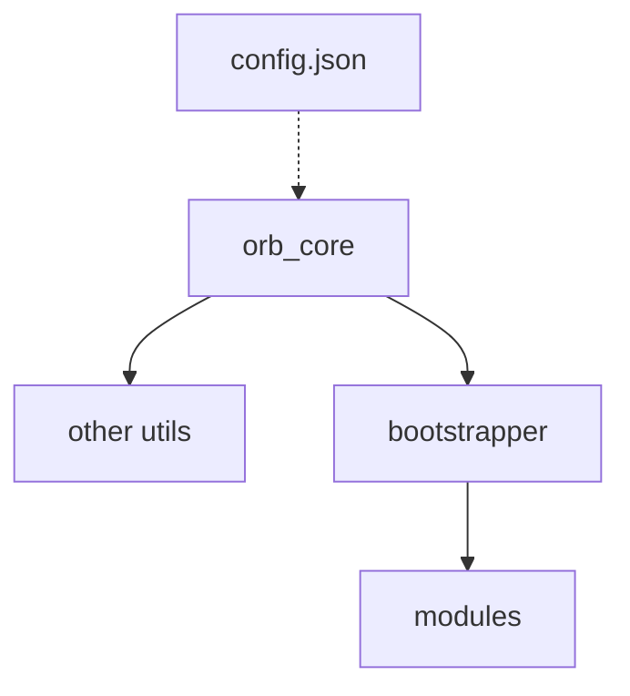

## orb.py Rewrite
------------------------------

Orb is a discord bot I made several years ago for the SMACK UQ Discord server (and for fun). I've been gradually improving on it and trying to clean it up since the initial release, but frankly the codebase is a mess and I think it's time to start again. This is a clean-slate rebuild of the bot.

Previously I accepted PRs as long as they looked right, but I've decided that from Rewrite onwards I won't be accepting code submissions. This is partially because I felt the goal of the bot was moving away from what I wanted, partially so I can use this as an (admittedly simple) sample of my work, and partially because it's my bot and I can do what I want.

I do still take suggestions, so feel free to send me any!

## Acknowledgements:
- None for now

## Overview:
Orb comprises of a few different pieces. `orb_core` is the intial file which manages startup and keeps everything  working together nicely. Utils are 'core' modules for orb which provide abstract functionality such as database access via a facade-style design pattern. There may only be one util for one type of functionality, but the intent is that these can be swapped out at any time with no issue. Utils can directly access orb_core's config data if needed, by requesting this from the core.

Among these is the bootstrapper util, which doesn't  actually provide a utility service. Instead, it loads modules, which provide actual user-facing functionality. Bootstrapper is responsible for checking if each module is
compatible with orb's current setup, running startup tests, and loading it.

Util types are defined in the `/utils/utils.json`. These specs are currently in development, but should not be changed once fully stablised.

`orb_core` loads configuration data from a config.json file. This specifies information such as Discord status, activated or deactivated modules, and API keys. The spec of this config file is defined in the `config` directory. Other utils may store their own configs by prefixing them with their name, i.e.
`pin_config.json` for pins.

Orb's general structure can be seen in the diagram above.



## Module Structure:
Each module includes a section of inline JSON which defines some base attributes. These are as follows:
```json
{
    "type": "moduleType",
    "name": "Example module",
    "requires": [             // A list of utils required by this module
        "exampleUtilType",
        "anotherExampleUtilType"
    ],
    "provides": [             // A list of commands provided by the module
        "exampleCommand": {
            "triggers": [
                "o.example",
                "o.alternateTrigger"
            ],
            "description": "User-facing command description"
        }
    ]
}```